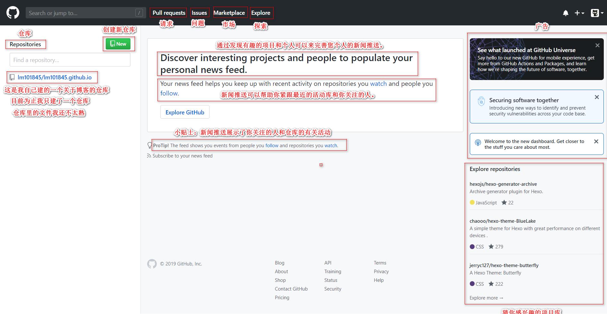
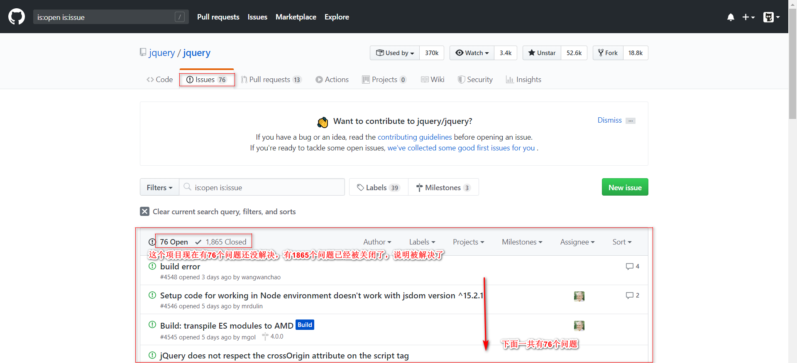
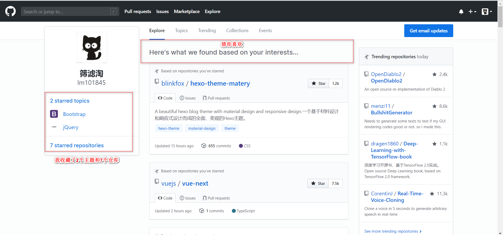
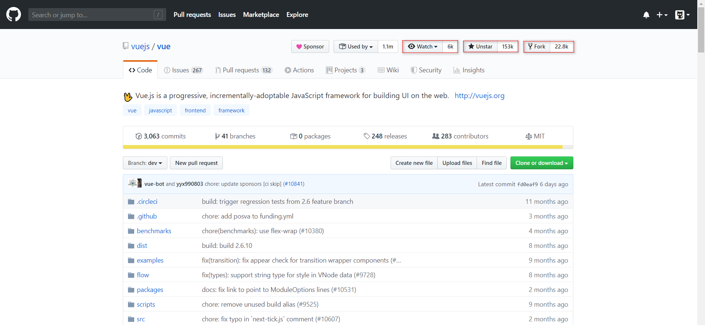
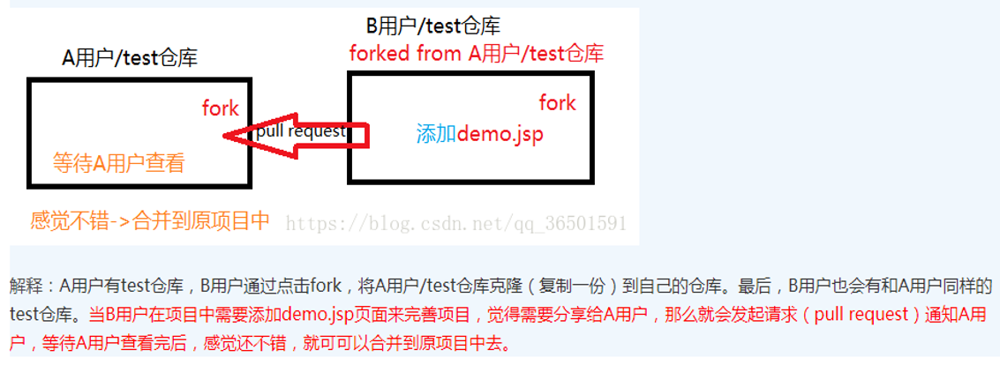
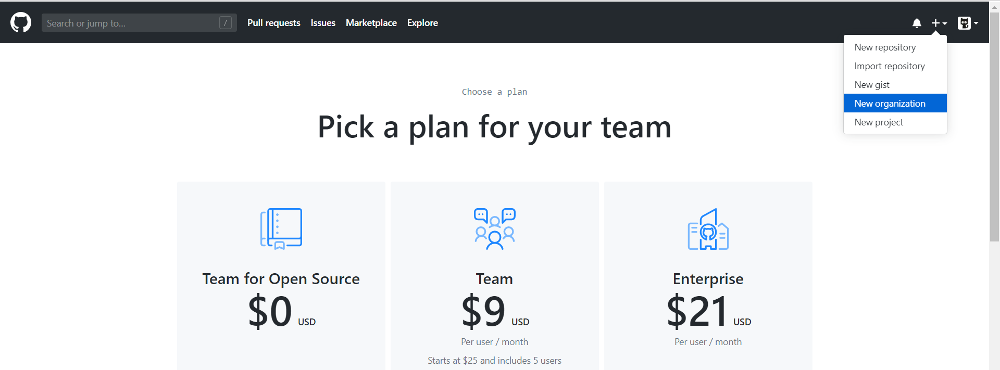
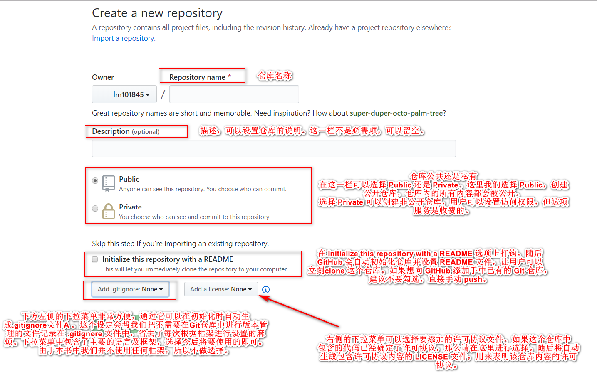

(注1：现在是2020年10月13日，此文宣告死亡，放弃，但是暂时也不删。)

关于Github的优秀入门教程，网上一搜一大推，但那毕竟是别人总结出来的，不是我。

> 我看过的关于Github的不错的教程：

[怎样使用 GitHub？文科妹子写的 Github 入门教程](https://www.zhihu.com/question/20070065/answer/79557687)

[专为设计师而写的GitHub快速入门教程](https://www.ui.cn/detail/20957.html)

[新手该如何使用 GitHub？](https://www.zhihu.com/question/21669554/answer/790851463)

> 一些关于Github的好的网站

[HelloGitHub](https://hellogithub.com/)

> Git 跟 GitHub 的关系：
>
> 解释1：大概就是「魔兽争霸」与「对战平台」的关系吧。
>
> 解释2：Git是一款免费、开源的分布式版本控制系统； Github是用Git做版本控制的代码托管平台
>
> 解释3：在 Git 中，开发者将源代码存入名叫“Git 仓库”的资料库中
> 并加以使用。而 GitHub 则是在网络上提供 Git 仓库的一项服务。
> 也就是说，GitHub 上公开的软件源代码全都由 Git 进行管
> 理。理解 Git，是熟练运用 GitHub 的关键所在。

虽然从去年（2018年）就注册了Github,也看过不少的入门视频和教程，但是总感觉隔着一层纱，对它熟悉不起来。究其原因，主要是自己并不常使用它，虽然Github上优秀的开源项目(优不优秀主要看star数多不多，毕竟群众的眼睛是雪亮的)种类繁多，浩如烟海，但自己毕竟是计算机初学者，编程语言和计算机基础知识都不扎实，即使看到star数特别多的项目，自己也人云亦云的star一下，但终究不知道这个明星项目到底是干什么用的，有什么优点，项目下的这些文件夹又都有什么用。最终star了一大推项目，如同一个收藏家，虽然明知是宝藏，却如同一个盲人，不懂得鉴赏，那宝藏对我来说又有何用呢？

这次自己新注册了一个账号，开始认真的系统学习Github。自己的原则是：

1. Github本质上是一个英文网站，首先你要搞清楚这个网站中每个英文单词的含义和用法吧。
2. 只star自己看得懂的项目和今后必须要看懂的项目。
3. 一边学，一边练，找一些前端初级的项目看一下。
4. 找了一本书《Github入门与实践》参考，书贵精不贵多。

自己现在的水平是：这个网站上的单词我都还没有完全熟悉它是什么意思，有什么用，接下来，就用我自己的方式记录下自己学习Github这一过程吧。

Github简介：

> github是一个基于git的代码托管平台，付费用户可以建私人仓库，我们一般的免费用户只能使用公共仓库，也就是代码要公开。
>
> Github 由Chris Wanstrath, PJ Hyett 与Tom Preston-Werner三位开发者在2008年4月创办。迄今拥有59名全职员工，主要提供基于git的版本托管服务。

这是我打开Github时的初始网页：

> GitHub 除项目之外，还可以把注意力集中到人身上。我们不但能阅
> 览一个人公开的所有源代码，只要查看其控制面板中的 News Feed，还能知道他对哪些仓库感兴趣，什么时候做过提交等。一个人在 GitHub
> 进行的开发是一目了然的

# 相关术语01

## Repository:仓库

简称repo,可以理解为"仓库"，我们的项目就存放在仓库之中。也就是说，如果我们想要建立项目，就得先建立仓库；如果你开源的项目多了，你就拥有了多个 Repositories 。

## Issues:问题

可以理解为“问题”，举一个简单的例子，如果我们开源一个项目，如果别人看了我们的项目，并且发现了bug，或者感觉那个地方有待改进，他就可以给我们提出Issue，等我们把Issues解决之后，就可以把这些Issues关闭；反之，我们也可以给他人提出Issue。

Issue 功能，是将一个任务或问题分配给一个 Issue 进行追踪和管理
的功能。

在 GitHub 上，每当进行Pull Request(见下文)，
都会同时创建一个 Issue。
每一个功能更改或修正都对应一个 Issue，讨论或修正都以这个
Issue 为中心进行。只要查看 Issue，就能知道和这个更改相关的一切信
息，并以此进行管理。

打开Marketplace后显示这个，我暂时用不到：（截了一部分，应该是市场中的各种工具，有的要钱有的不要钱）

打开Explore后显示这个：

随便打开一个自己收藏的项目：

## Star:收藏

收藏项目，方便下次查看。

仓库主页star按钮，意思为收藏项目的人数，在 GitHub 上如果你有一个项目获得100个star都算很不容易了！

（这个vue.js是尤雨溪开发的一个前端框架，有15万多关注，很厉害）

## Fork：复制克隆项目

这个不好翻译，如果实在要翻译我把他翻译成分叉，什么意思呢？

你开源了一个项目，别人想在你这个项目的基础上做些改进，然后应用到自己的项目中，

这个时候他就可以 Fork 你的项目（打开项目主页点击右上角的fork按钮即可），

然后他的 GitHub 主页上就多了一个项目，只不过这个项目是基于你的项目基础（本质上是在原有项目的基础上新建了一个分支），他就可以随心所欲的去改进，但是丝毫不会影响原有项目的代码与结构。

## Pull Request:发起请求

发起请求，这个其实是基于 Fork 的，还是上面那个例子，如果别人在你基础上做了改进，后来觉得改进的很不错，应该要把这些改进让更多的人收益，于是就想把自己的改进合并到原有项目里，这个时候他就可以发起一个 Pull Request（简称PR） ，原有项目创建人，也就是你，就可以收到这个请求，这个时候你会仔细review他的代码，并且测试觉得OK了，就会接受他的PR，这个时候他做的改进原有项目就会拥有了。

## Watch：关注

关注项目，当项目更新可以接收到通知。

这个也好理解就是观察，如果你 Watch 了某个项目，那么以后只要这个项目有任何更新，你都会第一时间收到关于这个项目的通知提醒。

## Commit:提交(快照)

你出了一版方案A，在大家讨论后，你改到B，结果再讨论，大家觉得还是不如用A，这时发现A没有另存，还得再改回去！在GitHub中就不用担心，它会记录你提交的每个版本，并把这些都放在一个仓库（Repository）里，而每一次提交改变就是 Commit，你可以随时回退到任意一个版本。

## Branch:分支

此外你还很可能遇到方案衍生的情况，在方案A的基础上，改出了一种方案B，又改出了一种方案C，可能还分别衍生出B1、B2及C1、C2，在GitHub里有分支（Branches）可以记录这种方案的分化过程。

## Wiki:维基

通过 Wiki 功能，任何人都能随时对一篇文章进行更改并保存，因
此可以多人共同完成一篇文章。该功能常用在开发文档或手册的编写中。

Wiki 页也是作为 Git 仓库进行管理的，改版的历史记录会被切实保
存下来，使用者可以放心改写。由于其支持克隆至本地进行编辑，所以
程序员使用时可以不必开启浏览器。

## Git 仓库

一般情况下，我们可以免费建立任意个 GitHub 提供的 Git 仓库。但
如果需要建立只对特定人物或只对自己公开的私有仓库，则需要依照套
餐类型支付每月最低 7 美元的使用费。

## Organization:组织

通常来说，个人使用时只要使用个人账户就足够了，但如果是公
司，建议使用 Organization 账户。它的优点在于可以统一管理账户和权
限，还能统一支付一些费用。

如果只使用公开仓库，是可以免费创建 Organization 账户的。因此，
如果是以交流群或 IT 小团体的形式进行软件开发时不妨试一试。

------

# 相关术语02

## 社会化编程：

在 GitHub 出现之前，软件开发中只有一小部分人拥有更改源代码
的权利，这个特权阶级掌握着开发的主导权。开发者在改写、发布源代码之外，往往需要花更多时间和精力去说服这个特权阶级。这导致了许
多起初效率很高的流行软件越发保守化，最终被时代所抛弃。

但是，GitHub 的出现为软件开发者的世界带来了真正意义上的“民
主”，让所有人都平等地拥有了更改源代码的权利。这在软件开发领域
是一场巨大的革命。而革命领导者 GitHub 的口号便是“社会化编程”。

# 创建新仓库

输入选择都完成后，点击 Create repository 按钮，完成仓库的创建。

## README.md

README.md 在初始化时已经生成好了。README.md 文件的内容
会自动显示在仓库的首页当中。因此，人们一般会在这个文件中标明本
仓库所包含的软件的概要、使用流程、许可协议等信息。如果使用
Markdown 语法进行描述，还可以添加标记，提高可读性。

> 使用 GitHub 后，很多文档都需要用 Markdown 来书写。也就是说，
> 全世界有大量程序员都在使用 Markdown，因此掌握这种语法已经成为
> 程序员的标准技能之一。请各位也务必学会 Markdown 语法。

