(注1：本文大部分内容来源于《ProGit2》,也可以说是此书的读书笔记，后面越看越不懂，索性把书上的笔记几乎都删了，根据看的视频重新写的笔记，删于2019年12月23日)

(注2：写的很乱，没啥体系，基本是东抄西抄，主要是给自己过一遍。）

 (注3：现在是2020年10月13日，此文乱七八糟的，宣告死亡，放弃。但是暂时也不删除，留下学习的足迹。)

# 大体介绍

Git 是目前世界上被最广泛使用的现代软件版本管理系统。Git 本身亦是一个成熟并处于活跃开发状态的开源项目，它最初是由 Linux 操作系统内核的创造者 Linus Torvalds 在 2005 年创造。

Git 使用分散式架构，是分散式版本管理 DVCS（Distributed Version Control System）的代表。相较于例如 CVS 或者 SVN 等集中式版本管理软件，Git 并不是将代码的所有修改历史保存在中心服务器中。在 Git 中取而代之的是，所有参与项目的开发者都拥有各自的代码完全拷贝，并在自己的拷贝上进行软件开发。

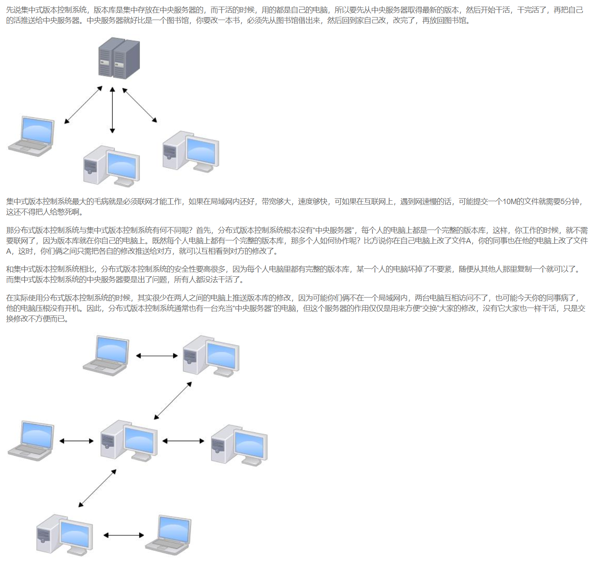

> 使用 Git 你可以确信你拥有代码的完整修改历史。 

## 关于版本控制

版本控制就是管理更新的历史记录。它为我们提供了一些在软件开发过程中必不可少的功能，例如记录一款软件添加或更改源代码的过版本控制是一种记录一个或若干文件内容变化，以便将来查阅特定版本修订情况的系统。程，回滚到特定阶段，恢复误删除的文件等。

如果你是位图形或网页设计师，可能会需要保存某一幅图片或页面布局文件的所有修订版本（这或许是你非常渴望拥有的功能），采用版本控制系统（VCS）是个明智的选择。 有了它你就可以将某个文件回溯到之前的状态，甚至将整个项目都回退到过去某个时间点的状态，你可以比较文件的变化细节，查出最后是谁修改了哪个地方，从而找出导致怪异问题出现的原因，又是谁在何时报告了某个功能缺陷等等。 使用版本控制系统通常还意味着，就算你乱来一气把整个项目中的文件改的改删的删，你也照样可以轻松恢复到原先的样子。 但额外增加的工作量却微乎其微。

## 命令行

Git 有多种使用方式。 你可以使用原生的命令行模式，也可以使用 GUI 模式（图形用户界面，是指采用图形方式显示的计算机操作用户界面），这些 GUI 软件
也能提供多种功能。 

在本书中，我们将使用命令行模式。 这是因为首先，只有在命令行模式
下你才能执行 Git 的 所有 命令，而大多数的 GUI 软件只实现了 Git 所有功能的一个子集以降
低操作难度。 如果你学会了在命令行下如何操作，那么你在操作 GUI 软件时应该也不会遇到
什么困难，但是，反之则不成立。 此外，由于每个人的想法与侧重点不同，不同的人常常会
安装不同的 GUI 软件，但 所有 人一定会有命令行工具。

> 假如你是 Mac 用户，我们希望你懂得如何使用终端（Terminal）；假如你是 Windows 用户，
> 我们希望你懂得如何使用命令窗口（Command Prompt）或 PowerShell。 如果你尚未掌握以
> 上技能，我们建议你先停下来快速学习一下，本书中的讲述和举例将用到这些技能。

## 三种状态

好，请注意。 如果你希望后面的学习更顺利，记住下面这些关于 Git 的概念。 Git 有三种状
态，你的文件可能处于其中之一：已提交（committed）、已修改（modified）和已暂存
（staged）。 已提交表示数据已经安全的保存在本地数据库中。 已修改表示修改了文件，但
还没保存到数据库中。 已暂存表示对一个已修改文件的当前版本做了标记，使之包含在下次
提交的快照中。

由此引入 Git 项目的三个工作区域的概念：<strong style="color:red">Git 仓库(Repository)、工作目录(work tree)以及暂存区域(index)。</strong>

```
1. Git 仓库目录是 Git 用来保存项目的元数据和对象数据库的地方。 这是 Git 中最重要的部分，
从其它计算机克隆仓库时，拷贝的就是这里的数据。

2. 工作目录是对项目的某个版本独立提取出来的内容。 这些从 Git 仓库的压缩数据库中提取出
来的文件，放在磁盘上供你使用或修改。

3. 暂存区域是一个文件，保存了下次将提交的文件列表信息，一般在 Git 仓库目录中。 有时候
也被称作``索引''，不过一般说法还是叫暂存区域。
```

> 基本的 Git 工作流程如下：
> 1. 在工作目录中修改文件。
> 2. 暂存文件，将文件的快照放入暂存区域。
> 3. 提交更新，找到暂存区域的文件，将快照永久性存储到 Git 仓库目录。
>     如果 Git 目录中保存着的特定版本文件，就属于已提交状态。 如果作了修改并已放入暂存区
>     域，就属于已暂存状态。 如果自上次取出后，作了修改但还没有放到暂存区域，就是已修改
>     状态。 

### 举个例子

服装厂通过生产车间做衣服，衣服做完先放小推车里，然后利用小推车送到仓库储存。

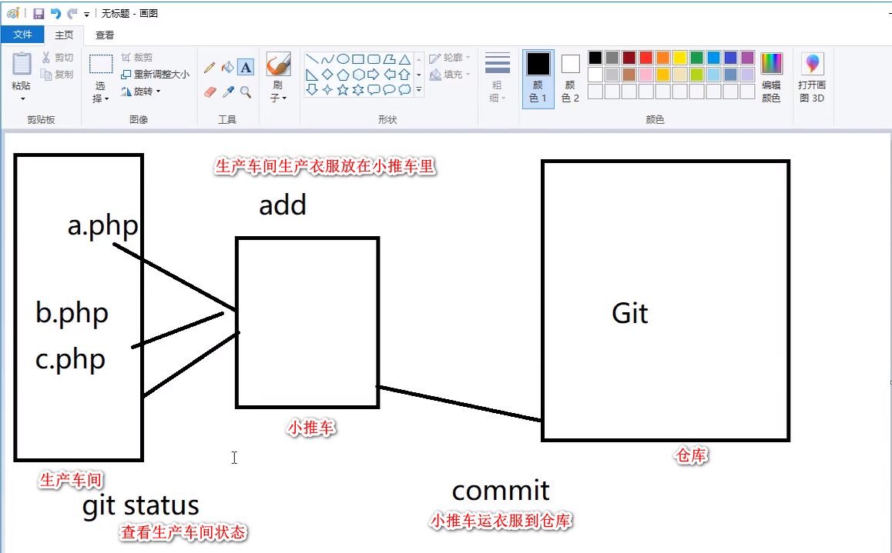

> 通过 git add命令将文件加入暂存区 ，再通过 git commit命令
> 提交。
>
> 可以通过git status查看"生产车间"的状态

将代码修改后代码会先进入暂存区，颜色是红色

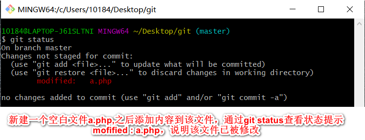

之后通过git add a.php将代码再从生产车间放到小推车里，此时颜色变成绿色了

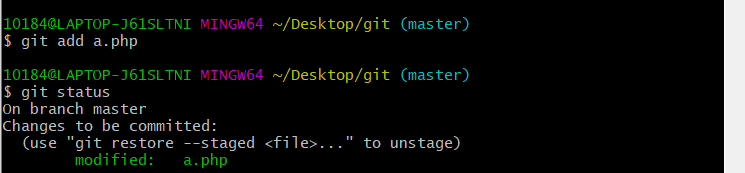

### 记录每次更新到仓库

现在我们手上有了一个真实项目的 Git 仓库，并从这个仓库中取出了所有文件的工作拷贝。
接下来，对这些文件做些修改，在完成了一个阶段的目标之后，提交本次更新到仓库。
请记住，你工作目录下的每一个文件都不外乎这两种状态：已跟踪或未跟踪。 已跟踪的文件
是指那些被纳入了版本控制的文件，在上一次快照中有它们的记录，在工作一段时间后，它
们的状态可能处于未修改，已修改或已放入暂存区。 工作目录中除已跟踪文件以外的所有其
它文件都属于未跟踪文件，它们既不存在于上次快照的记录中，也没有放入暂存区。 初次克
隆某个仓库的时候，工作目录中的所有文件都属于已跟踪文件，并处于未修改状态。
编辑过某些文件之后，由于自上次提交后你对它们做了修改，Git 将它们标记为已修改文件。
我们逐步将这些修改过的文件放入暂存区，然后提交所有暂存了的修改，如此反复。所以使
用 Git 时文件的生命周期如下：


# 基本操作

## 创建新仓库（初始化仓库）

~~~
$ git init
~~~

> 注：这个文件夹要是空的，而且初始化后.git文件是隐藏的，要取消隐藏才能看见

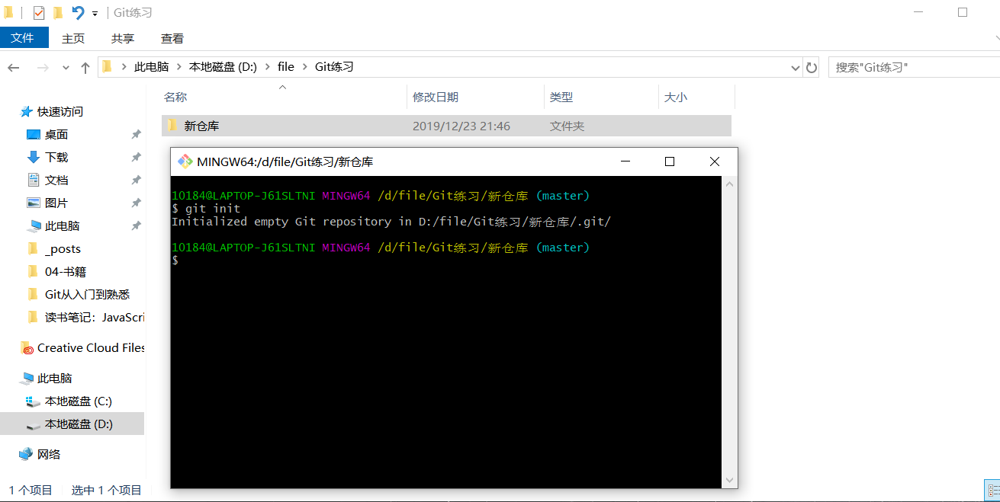

.git文件包括以下内容

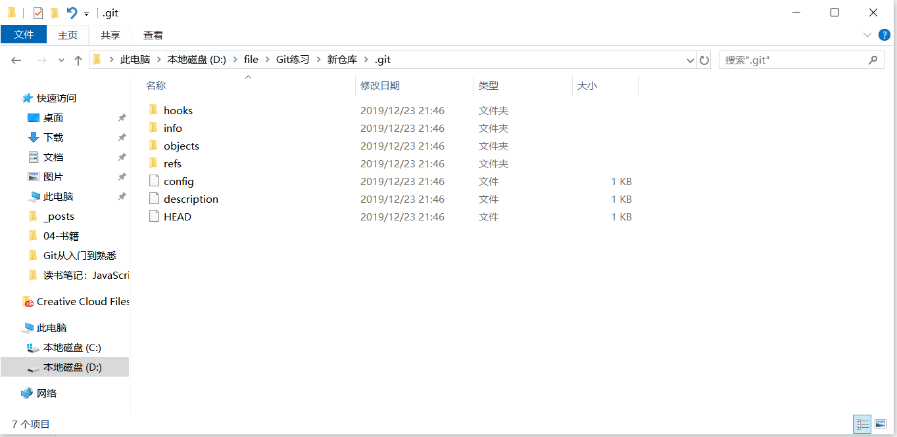

~~~
hooks         该目录用于配置 客户端执提交操作用于触发服务端的脚本配置，一般用于自动化部署使用
info          该目录用于配置一些不希望被 Git 管控的文件。
objects       该目录用于存储所有数据对象内容，这些数据内容类型有 commit tree blob tag
refs          该目录用于存储 Git 本地以及远程分支的引用，当然还有一种特殊的引用标签引用
config        该文件包含项目特有的配置选项，并且该配置仅对该 Git 仓库有效
description   该文件仅供 GitWeb 程序使用
HEAD          该文件表示当前 Git 仓库处于哪个分支
index         该文件保存暂存区信息 （空仓库下该文件不会显示一旦执行 git add 操作该文件就会出现）
~~~

## 克隆现有的仓库

如果你想获得一份已经存在了的 Git 仓库的拷贝，比如说，你想为某个开源项目贡献自己的一
份力，这时就要用到  git clone  命令。

Git 克隆的是该 Git 仓库服务器上的几乎所有数据，而不是仅仅复制完
成你的工作所需要文件。 当你执行  git clone  命令的时候，默认配置下远程 Git 仓库中的每
一个文件的每一个版本都将被拉取下来。 事实上，如果你的服务器的磁盘坏掉了，你通常可
以使用任何一个克隆下来的用户端来重建服务器上的仓库（虽然可能会丢失某些服务器端的
挂钩设置，但是所有版本的数据仍在。

克隆仓库的命令格式是  git clone [url]  。

~~~
$ git clone https://github.com/lm101845/lm101845.github.io.git
$ git clone git@github.com:lm101845/lm101845.github.io.git
~~~

> Git 支持多种数据传输协议。常用的有两种，一种是Clone with HTTPS，一种是Clone with SSH,都可以

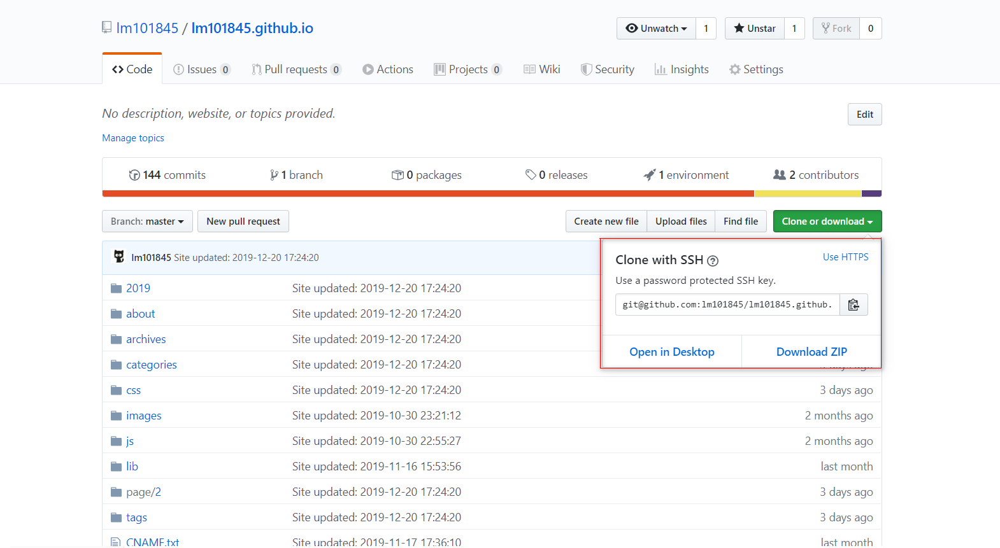

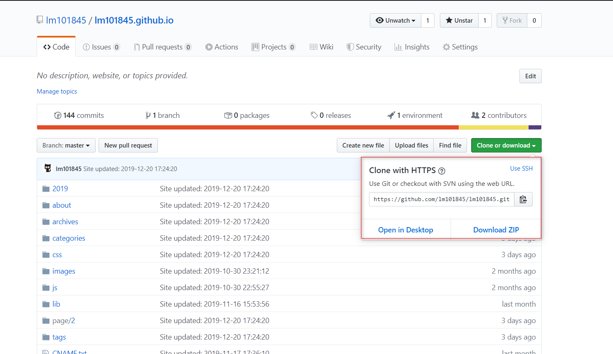


## 忽略特殊文件- .gitignore(不熟)

有些时候，你必须把某些文件放到Git工作目录中，但又不能提交它们，比如保存了数据库密码的配置文件啦，等等，每次`git status`都会显示`Untracked files ...`，有强迫症的童鞋心里肯定不爽。

好在Git考虑到了大家的感受，这个问题解决起来也很简单，在Git工作区的根目录下创建一个特殊的`.gitignore`文件，然后把要忽略的文件名填进去，Git就会自动忽略这些文件。

不需要从头写`.gitignore`文件，GitHub已经为我们准备了各种配置文件，只需要组合一下就可以使用了。所有配置文件可以直接在线浏览：<https://github.com/github/gitignore>

忽略文件的原则是：

~~~
忽略操作系统自动生成的文件，比如缩略图等；
忽略编译生成的中间文件、可执行文件等，也就是如果一个文件是通过另一个文件自动生成的，那自动生成的文件就没必要放进版本库，比如Java编译产生的.class文件；
忽略你自己的带有敏感信息的配置文件，比如存放口令的配置文件。
~~~

[Git忽略提交规则 - .gitignore配置运维总结](<https://www.cnblogs.com/kevingrace/p/5690241.html>)

[忽略特殊文件](<https://www.liaoxuefeng.com/wiki/896043488029600/900004590234208>)

## 移除文件-rm

~~~
删除某个文件：本地和仓库都删除了
$ git rm a.txt
~~~

~~~
删除某个文件：仓库删除，但是本地还有
$ git rm -- cached a.txt (多了个cathed)
~~~

## 版本库修改资料名称

~~~
前提：a.txt已经提交(commit)到仓库了，此时给它修改名称为b.txt
$ git mv a.txt b.txt
此时将修改名称后的文件再提交
$ git commit -m "a.txt rename b.txt"
~~~

## 使用日志

~~~
$ git log
$ git log -p
$ git log --online
$ git log --name-only(查看有哪些文件发生了变化)
~~~

每一次提交都会有一个哈希字符串，下面是作者，再下面是描述

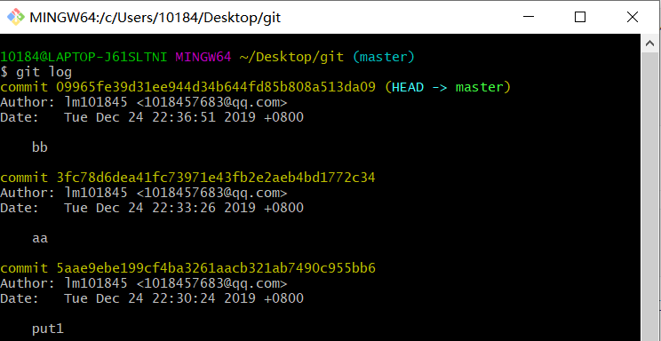

## 修改文件里的内容

~~~
$ vim a.txt
常用按键：
i(插入)
只有按Esc
然后再按":wq",就可以保存并退出vim编辑器了
~~~

## 修改最新一次提交事件

~~~
$ git commit --amend
~~~

我的出现了问题，现在也没精力去解决这个了，以后再说吧。问题如下：

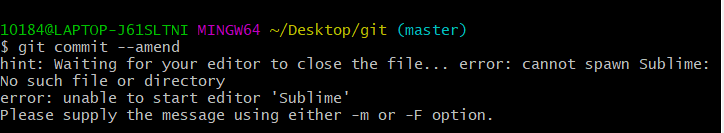

## 管理暂存区中的文件

~~~
将第一次运输车中的文件再放回工厂重新加工
$ git rm --cached 文件名.后缀名

将第二次及以上运输车中的文件再放回工厂重新加工
$ git reset HEAD 文件名.后缀名

文件恢复到最初的状态
$ git checkout -- 文件名.后缀名
~~~

## 设置你的用户名称与邮件地址

```
$ git config --global user.name "John Doe"
$ git config --global user.email johndoe@example.com
```

## 查看文件里的内容

~~~
$ cat 文件名.后缀名
~~~

## alias命令别名

~~~
相当于git add.命令用git a .命令替代
$ git config --global alias.a add
~~~

## 查看文件最新修改的地方

~~~
$ git diff 文件名
~~~

## Tag标签

~~~
给当前项目打上v1.0的标签
$ git tag v1.0
标签就是对某一个阶段的一个总结，这个阶段一定是已经完成的，相对稳定的状态，标签不能随便打。
~~~

## 生成zip压缩包

~~~
压缩文件，文件名叫hdcms
$ git archive master --prefix='hdcms'--forma=zip > hdcms.zip
~~~

# Git分支

为了真正理解 Git 处理分支的方式，我们需要回顾一下 Git 是如何保存数据的。

Git 保存的不是文件的变化或者差异，而是一系列不
同时刻的文件快照。

在进行提交操作时，Git 会保存一个提交对象（commit object）。知道了 Git 保存数据的方
式，我们可以很自然的想到——该提交对象会包含一个指向暂存内容快照的指针。 但不仅仅
是这样，该提交对象还包含了作者的姓名和邮箱、提交时输入的信息以及指向它的父对象的
指针。首次提交产生的提交对象没有父对象，普通提交操作产生的提交对象有一个父对象，
而由多个分支合并产生的提交对象有多个父对象。

## 查看分支

~~~
$ git branch
~~~

## 创建分支

~~~
创建一个分支，名叫ask
$ git branch ask
~~~

## 切换分支

> 切换到别的分支之前必须要先将本分支的文件先提交才能切换，否则不让你切换

~~~
切换到ask分支
$ git checkout ask
~~~

## 创建一个分支并切换到此分支

~~~
创建一个bbs分支并切换到此分支
$ git checkout -b bbs
~~~

## 分支的合并

~~~
将ask分支的内容合并到master主分支上来
$ git merge ask
~~~

## 删除分支

~~~
当分支里的内容已经开发完成，并将内容合并到主分支后，该分支就没用了，就可以卸磨杀驴删除此分支了
删除ask分支
$ git branch -d ask
~~~

## 查看已合并(未合并)的分支

~~~
$ git branch --merged       //查看已合并分支
$ git branch --no-merged   //查看未合并分支
~~~

## stash临时储存区

我新建了两个分支，ask和bbs,在ask分支里进行了有关操作，但还没修改完，仅仅是先放在了小推车中（执行了git add .功能），还没有进行提交，此时我要去另一个分支bbs，此时会报错

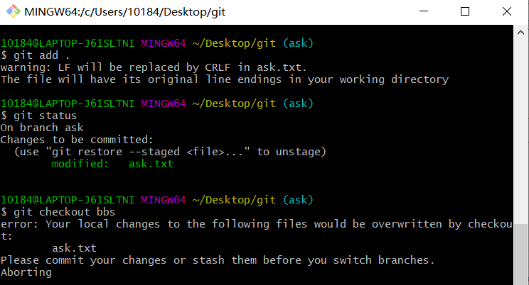

此时使用

~~~
$ git stash
~~~

可以将文件先暂存起来，此时可以去别的分支进行工作了。

等要恢复暂存区时，使用命令

~~~
git stash apply
~~~

可进行恢复

~~~
删除暂存区
$ git stash drop stash@{0}

暂存区列表
$ git stash list

恢复暂存区
$ git stash pop
~~~


# 常用Linux命令

~~~
1. ls(List): 列举出当前工作目录的内容（文件或文件夹）
2. pwd(Print Working Directory):显示当前工作目录
3. cd(Change Directory):切换文件路径，cd 将给定的文件夹（或目录）设置成当前工作目录。
4. mkdir(Make Directory):用于新建一个新目录
5. rmdir( Remove Directory):删除给定的目录
6. rm(Remove):删除给定的文件
7. cp(Copy):对文件进行复制
8. mv(Move):对文件或文件夹进行移动,如果文件或文件夹存在于当前工作目录，还可以对文件或文件夹进行重命名。
9. touch:建立空白文件
10. rm -rf*: 从删库到跑路

~~~

# 常用命令含义

~~~
changes to be commited
代码等着提交到仓库里面去
~~~

~~~
$ git commit -m '测试学习'
代码提交到仓库，起个名字叫做"测试学习"
~~~

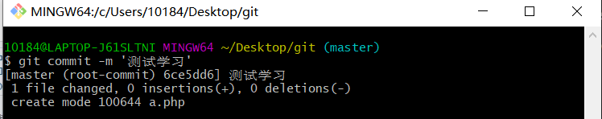、

~~~
$ git add .（add与.中间有空格）
将所有生产车间的衣服都放入小推车
~~~

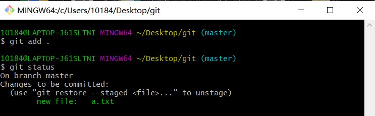
~~~
$ git status
检查当前文件状态
~~~


# 常见错误指令

~~~
$ git status
fatal: this operation must be run in a work tree(工作目录)
~~~

~~~
$ git add a.php
fatal: pathspec 'a.php' did not match any files
~~~


